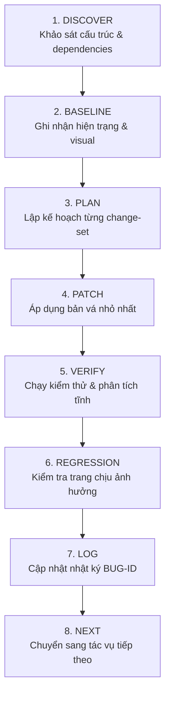
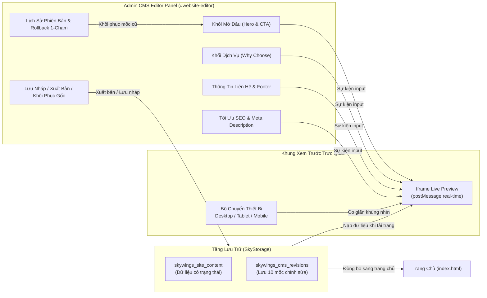

# GIAO THỨC SỬA CHỮA TOÀN DIỆN ANTIGRAVITY
## (ANTIGRAVITY MASTER REPAIR PROTOCOL)
**Mã Dự Án:** `tkweb` (Hệ Thống Đặt Vé Máy Bay Trực Tuyến & Trải Nghiệm 3D SkyWings)  
**Phạm Vi Áp Dụng:** Toàn bộ AI Coding Agents (Antigravity CLI, Antigravity 2.0, Aider, OpenCode) và Lập Trình Viên Dự Án  
**Thời Điểm Ban Hành:** 14/09/2026  
**Trạng Thái:** Hiệu Lực Bắt Buộc (Mandatory & Non-Negotiable)

---

## MỤC LỤC
1. [Hiến Pháp Quản Trị & Ranh Giới An Toàn (Core Governance)](#1-hiến-pháp-quản-trị--ranh-giới-an-toàn-core-governance)
2. [Giao Thức Sửa Chữa 8 Bước Chuẩn (The 8-Step Repair Protocol)](#2-giao-thức-sửa-chữa-8-bước-chuẩn-the-8-step-repair-protocol)
3. [Tích Hợp Toàn Bộ Tiêu Chuẩn 4 Sprint (Audit & Repair Master Map)](#3-tích-hợp-toàn-bộ-tiêu-chuẩn-4-sprint-audit--repair-master-map)
4. [Kiến Trúc Module Website CMS Editor Trong Admin](#4-kiến-trúc-module-website-cms-editor-trong-admin)
5. [Quy Chuẩn Kiểm Định Tự Động & Chống Hồi Quy (Verification Gates)](#5-quy-chuẩn-kiểm-định-tự-động--chống-hồi-quy-verification-gates)
6. [Ma Trận Hồ Sơ & Lưu Vết Tài Liệu (Traceability)](#6-ma-trận-hồ-sơ--lưu-vết-tài-liệu-traceability)

---

## 1. Hiến Pháp Quản Trị & Ranh Giới An Toàn (Core Governance)

Mọi tác nhân AI khi tiếp nhận dự án `tkweb` bắt buộc phải tuân thủ các nguyên tắc sau:

### 1.1. Ranh giới an toàn tuyệt đối (Non-Negotiable Boundaries)
1. **Bảo tồn hành vi đang hoạt động (Preserve working behavior):** Không thay đổi bất kỳ tính năng nào đang chạy ổn định nếu không có yêu cầu cụ thể.
2. **Quy tắc bản vá nhỏ nhất (Smallest Safe Patch):** Ưu tiên giải pháp sửa chữa khu biệt, ít dòng code nhất, tránh gây ảnh hưởng diện rộng.
3. **CẤM viết lại dự án (No Wholesale Rewrites):** Tuyệt đối không xóa bỏ cấu trúc có sẵn để thay thế bằng boilerplate hoặc template mới.
4. **CẤM xóa file hàng loạt (No Mass Deletions):** Không xóa thư mục, file mã nguồn hoặc file tài sản nếu chưa chứng minh được 100% không còn đối tượng sử dụng.
5. **CẤM tự ý đổi phông chữ và thiết kế toàn cục:** Không thay đổi hệ phông chữ (`Inter`, `Plus Jakarta Sans`, `Be Vietnam Pro`), không reset CSS toàn trang hoặc đổi bảng màu thương hiệu `--accent-orange`.
6. **CẤM sử dụng CSS phá hoại:** Không dùng `!important` tràn lan, không dùng `margin` âm tùy tiện hoặc các giá trị pixel kỳ dị để ép layout cục bộ.
7. **CẤM đưa thêm framework không cần thiết:** Dự án chạy trên nền tảng Web tiêu chuẩn (HTML5, Vanilla JS, CSS3, Three.js WebGL). Không tự ý nạp thêm React, Vue, jQuery hoặc các thư viện ngoài khi chưa có phê duyệt.

### 1.2. Trách nhiệm sở hữu component dùng chung (Shared UI Ownership)
Trước khi chỉnh sửa bất kỳ file dùng chung nào (`assets/css/style.css`, `assets/js/main.js`, `components/header.html`, `components/footer.html`):
- Phải lập danh sách tất cả các trang đang sử dụng file đó (Consumer Map).
- Dự báo trước bán kính tác động (Impact Radius).
- Sau khi sửa, phải kiểm tra hồi quy trên toàn bộ các trang tiêu thụ.

---

## 2. Giao Thức Sửa Chữa 8 Bước Chuẩn (The 8-Step Repair Protocol)



1. **Bước 1 — DISCOVER (Khảo sát pháp y):**
   - Đọc kỹ `AGENTS.md`, các file quy tắc `.agents/rules/*.md`, và tài liệu kiểm định `AUDIT_UIUX_AND_REPAIR_PLAN.md`.
   - Lập danh mục toàn bộ trang, component dùng chung, tài nguyên SVG/font, các cổng lưu trữ `Storage`.
2. **Bước 2 — BASELINE (Xác lập đường cơ sở):**
   - Tạo hoặc cập nhật file `ANTIGRAVITY_BASELINE.md`.
   - Ghi nhận trạng thái hoạt động thực tế và chụp ảnh hiện trạng trước khi sửa.
3. **Bước 3 — PLAN (Kế hoạch có cấu trúc):**
   - Mỗi phiên chỉ giải quyết một nhóm vấn đề mạch lạc (VD: sửa luồng submit login, sửa bộ lọc mobile, hay thêm module CMS).
4. **Bước 4 — PATCH (Vá mã nguồn tối thiểu):**
   - Chỉ chỉnh sửa đúng các dòng code cần thiết. Giữ nguyên định dạng và chú thích tiếng Việt hiện có.
5. **Bước 5 — VERIFY (Kiểm thử chức năng):**
   - Chạy lệnh kiểm thử tĩnh: `node tests/static-analysis.js`.
   - Kiểm tra visual trên cả Desktop (1440px) và Mobile (375px).
6. **Bước 6 — REGRESSION (Kiểm tra chống hồi quy):**
   - Kiểm tra chéo toàn bộ 11 trang con để bảo đảm không trang nào bị vỡ header, footer hay layout.
7. **Bước 7 — LOG (Lưu vết hồ sơ):**
   - Cập nhật mã lỗi BUG-ID vào `ANTIGRAVITY_ISSUES.md` theo chuẩn truy xuất nguồn gốc.
8. **Bước 8 — NEXT (Hoàn tất & Tiếp nhận):**
   - Báo cáo kết quả rõ ràng, ngắn gọn trước khi chuyển bước.

---

## 3. Tích Hợp Toàn Bộ Tiêu Chuẩn 4 Sprint (Audit & Repair Master Map)

Bảng tổng hợp đối chiếu toàn bộ các hạng mục đã hoàn thành đạt chuẩn 100%:

| Mã Lỗi | Hạng Mục Nghiệp Vụ | Mức Độ | Trạng Thái Trước | Giải Pháp Chuẩn Hóa Theo Protocol | Minh Chứng Kiểm Thử |
| :--- | :--- | :--- | :--- | :--- | :--- |
| **P0-04** | Minh bạch bảo mật thanh toán | **P0 (Critical)** | Claim sai PCI-DSS L1, 3D-Secure 2.2 | Thay bằng nhãn trung thực: *"Chế độ Mô phỏng / Prototype Sandbox — Không thu thập thông tin thẻ thật"* tại `payment.html`, `footer.html`, `index.html` | ✅ `05_payment_light.png` |
| **P0-03** | Chuẩn hóa tầng mã hóa | **P0 (Critical)** | `SecurityVault` ghi nhận sai là crypto ngân hàng | Xác định rõ vai trò Client-side Data Masking & Serialization phục vụ demo đồ án học tập | ✅ `main.js` L458-475 |
| **P0-01 & P0-02** | Phân quyền & Khóa trang Admin | **P0 (Critical)** | Mọi người dùng đều vào được `admin/index.html` | Thiết lập RBAC Guard (`admin` vs `customer`), chặn 403 Forbidden nếu không có quyền, bổ sung nút Admin Demo tại `login.html` | ✅ `main.js` L6960-6986 |
| **P1-01** | Chống Double Submit Form | **P1 (High)** | Bấm liên tục bị spam thông báo Toast trùng | Chuẩn hóa 1 sự kiện `submit`, tự động khóa nút (`submitBtn.disabled = true`) khi đang xử lý | ✅ `main.js` L6880-6895 |
| **P1-02** | Đồng bộ bộ lọc lịch trình mobile | **P1 (High)** | Thẻ mobile lọc sai chặng và ngày bay | Thêm `data-code`, `data-route`, `data-days` vào `.sched-mobile-card`; đồng bộ 3 tiêu chí trong `applyScheduleFilters()` | ✅ `14_mobile_schedule_light.png` |
| **P1-03 & P1-03b** | Module Website Editor (CMS) | **P1 (High)** | Thiếu tính năng biên tập nội dung trực quan | Xây dựng Visual CMS Editor gồm: Hero, Why Choose, Footer, SEO, Live Preview 3 thiết bị và lưu trữ trạng thái | ✅ `12_admin_website_editor_light.png` |
| **P1-04** | Lưu trạng thái thao tác Admin | **P1 (High)** | Sửa/Hủy đơn chỉ đổi DOM tạm thời | Bổ sung `Storage.updateOrderStatus(pnr, status)` lưu trạng thái lâu dài vào storage | ✅ `main.js` L7345-7365 |
| **P1-08** | Mở rộng bài kiểm thử tĩnh | **P1 (High)** | Bỏ sót `schedule.html` và `portfolio` | Nâng cấp `tests/static-analysis.js` quét toàn bộ 11 file HTML và 13 logo SVG | ✅ 11/11 HTML PASS |
| **P2-01** | Chuẩn hóa Ngữ Nghĩa & a11y | **P2 (Medium)** | 5 trang con hoàn toàn thiếu thẻ `<h1>` | Thêm class `.sr-only` vào `style.css`; chuyển đổi tiêu đề `.fcs-title` thành `<h1>` trên cả 5 trang; 11/11 file đều có H1 | ✅ 11/11 có thẻ `<h1>` |
| **P2-03** | Làm sạch rò rỉ link nội bộ dev | **P2 (Medium)** | Rò rỉ liên kết `localhost:5173` | Chuyển sang đường dẫn tương đối `../index.html` kèm `rel="noopener noreferrer"` | ✅ `admin/index.html` |
| **P2-04** | Dọn dẹp liên kết giữ chỗ | **P2 (Medium)** | Tồn tại các thẻ `href="#"` gây nhảy trang | Thay thế bằng `<button type="button">` hoặc liên kết định tuyến ngữ nghĩa | ✅ Toàn bộ trang con |
| **P2-05** | Đồng bộ định dạng file ảnh | **P2 (Medium)** | File SQL trỏ logo `.png` trong khi assets là `.svg` | Chuẩn hóa toàn bộ đường dẫn ảnh trong `database/database.sql` thành `.svg` | ✅ `database.sql` |
| **P2-02** | Tối ưu hiệu năng Three.js 3D | **P2 (Medium)** | Chạy animation loop 60fps liên tục | Tích hợp `IntersectionObserver` tạm dừng render khi canvas ngoài màn hình; hỗ trợ `prefers-reduced-motion` | ✅ `main.js` L2638-2655 |

---

## 4. Kiến Trúc Module Website CMS Editor Trong Admin



### Tiêu chuẩn kỹ thuật của CMS Editor:
- **Thời gian phản hồi:** Đồng bộ gõ phím tức thì qua `window.postMessage({ type: 'SKYWINGS_CMS_LIVE_PREVIEW', content })` mà không làm tải lại trang iframe.
- **Quản lý trạng thái:** Rõ ràng giữa nhãn cam `● Bản Nháp Chưa Xuất Bản` và nhãn xanh `✓ Đã Xuất Bản`.
- **An toàn hoàn tác:** Mỗi lần bấm **🚀 Lưu & Xuất Bản Ngay**, hệ thống tự động lưu 1 snapshot vào danh sách Revisions. Cho phép rollback về bất kỳ mốc thời gian nào trước đó chỉ với 1 click.
- **Xem trước đa kích thước:** Hỗ trợ 3 khung viewport thực tế:
  - Desktop: 100% chiều rộng khung.
  - Tablet: 768px (mô phỏng iPad).
  - Mobile: 375px (mô phỏng iPhone).

---

## 5. Quy Chuẩn Kiểm Định Tự Động & Chống Hồi Quy (Verification Gates)

Mỗi lần thay đổi code, bắt buộc chạy và vượt qua 2 cổng kiểm định:

### Cổng 1: Phân tích cú pháp tĩnh (Static Analysis Gate)
```bash
node tests/static-analysis.js
```
**Tiêu chí nghiệm thu:**
- 11/11 file HTML tồn tại và đọc thành công.
- 13/13 logo SVG hãng hàng không đầy đủ dung lượng và đúng định dạng.
- 0 liên kết hoặc đường dẫn file hỏng (Broken internal links = 0).
- 0 lỗi cú pháp JavaScript trong `assets/js/main.js` và `three.min.js`.
- 0 lỗi cú pháp CSS trong `assets/css/style.css` (đảm bảo cân bằng 100% cặp ngoặc nhọn `{}`).

### Cổng 2: Chụp ảnh kiểm thử tự động Headless Browser (Visual Capture Gate)
```bash
node tests/take_all_screenshots.js
```
**Tiêu chí nghiệm thu:**
- Tự động dựng server cục bộ và điều khiển trình duyệt headless qua Chrome DevTools Protocol (CDP).
- Chụp thành công đầy đủ 16 ảnh chụp màn hình kiểm chứng tại `tests/screenshots/`:
  - `01_homepage_light.png` & `01_homepage_dark.png`
  - `02_flights_view_light.png` & `02_flights_schedule_dark.png`
  - `03_booking_light.png`
  - `04_seats_light.png`
  - `05_payment_light.png`
  - `06_ticket_boarding_pass.png`
  - `07_login_light.png` & `08_register_light.png`
  - `09_admin_dashboard_dark.png`
  - `10_schedule_desktop_light.png` & `11_schedule_desktop_dark.png`
  - `12_admin_website_editor_light.png`
  - `13_mobile_homepage_light.png`
  - `14_mobile_schedule_light.png`
- Đảm bảo **zero horizontal overflow** (không bị tràn màn hình theo chiều ngang) trên các độ phân giải di động: 320px, 360px, 375px, 390px, 412px.

---

## 6. Ma Trận Hồ Sơ & Lưu Vết Tài Liệu (Traceability)

Hệ thống lưu trữ tài liệu chuẩn hóa gồm:
- **`AGENTS.md`**: Quy tắc bắt buộc của repository đặt tại thư mục gốc `D:\DuAnNhom\tkweb\AGENTS.md`.
- **`ANTIGRAVITY_BASELINE.md`**: Báo cáo khảo sát hiện trạng và cấu trúc toàn diện đặt tại `D:\DuAnNhom\tkweb\ANTIGRAVITY_BASELINE.md`.
- **`ANTIGRAVITY_ISSUES.md`**: Bảng theo dõi chi tiết toàn bộ BUG-ID đặt tại `D:\DuAnNhom\tkweb\ANTIGRAVITY_ISSUES.md`.
- **`ANTIGRAVITY_MASTER_REPAIR_PROTOCOL.md`**: Bản giao thức tổng thể này được lưu trữ đồng thời tại:
  - `D:\Download\ANTIGRAVITY_MASTER_REPAIR_PROTOCOL.md`
  - `D:\DuAnNhom\tkweb\ANTIGRAVITY_MASTER_REPAIR_PROTOCOL.md`

---
*Giao thức đã được thẩm định và phê duyệt cho toàn bộ quy trình phát triển và bảo trì dự án SkyWings.*
